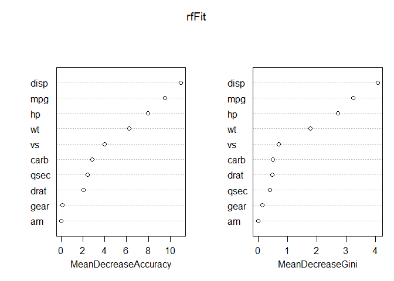

Programming Background
================

## My Programming Background

*What are your thoughts on R vs whatever other software you’ve used?*

-   My only programming experience prior to ST558 (R) is in ST555 (SAS).
    Initially, I thought R was much more complex and certainly didn’t
    prefer it. However, I’ve come to see the flexibility and open-ended
    design of R that makes it much less rigid than SAS.

*What functionality do you like about R?*

-   Personally, my favorite functionality of R so far is markdown. I am
    impressed with the reproducibility of making documents and how
    structured output can be with relatively minimal input. I have found
    public markdown templates for resumes, manuscripts, etc that are
    useful in the science sector and interesting to play around with. I
    also like that I can create my own templates and update as needed to
    fit my goals at the time. Additionally, I like the attitude
    surrounding R. SAS felt much heavier on the specifics since there
    was usually just one, maybe two ways to do something. With multiple
    ways to do things in R, it feels much lighter and allows me to focus
    on the output. There was a load of SAS help from SAS, but there has
    also been a ton of R help online as well.

*What parts do you miss about your other language?*

-   I miss the organization of SAS code. Writing code in steps felt much
    more structured than the line by line action R can take on. I also
    felt like errors had better context in SAS than they do in R, but
    that could be a lack of experience on my part.

*Do you consider R a difficult language to learn? (If you knew R prior
to the course, describe your experience when first learning it.)*

-   Learning object oriented programming after learning SAS can be
    tricky at first. Sometimes it’s hard to conceptualize entire
    datasets as objects and not just row by row, input to output
    reading. Getting used to packages can be tricky at first also. Since
    SAS is all inclusive, it was a challenge having to download 15
    packages with different functions or syntax for each. However, I do
    like that we’re able to stick with the tidyverse as a way to keep
    consistent. At work, data.table and ggplot are the two packages we
    primarily use and once familiarizing myself with those and doing
    some practical applications with example code, it all started to
    click. I have picked up the language and Rstudio much quicker than I
    picked up SAS for sure, probably thanks to my experience with SAS.

## Example R Markdown Output

Here is a plot of the iris data set.

<!-- -->
