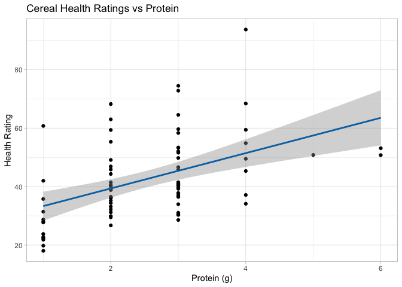

Blog Post 3 - R Programming Reflection
================

# **A reflection on learning to program in R**

I began this program looking forward to this class, specifically because
we use R so much at work and I was excited to catch up. While certainly
used for other applications, one of the most outward facing roles R
plays is the creation of graphs to depict experimental results. I’ve
always felt like nice look graphs could tidy up the most average results
and make them present super well. GraphPad has been my primary graphing
software but it doesn’t automate the way R does. That reproducibility is
just unmatched compared to point and click software. Also, the control
and ease of use seems better than SAS for my purposes.

Below, I’ll read in a sample cereal data set that has information about
different types of cereals and their nutrition content and health
rating. I’ll demonstrate making some scatter plots to investigate the
relationship between certain nutrients and the cereals health rating.
I’ll plot a nice looking plot for the first protein plot then mess with
controlling some ggplot features just to have fun and make a cooloer
looking plot for sugars.

``` r
#Read in data
cerealdata <- read.csv("/Users/EvanBrown/Desktop/ST558/cereal.csv")

#Inspect data
head(cerealdata)

#Investigate relationship between grams of protein as a predictor and rating as a response by plotting a scatter plot
proteinplot <- ggplot(cerealdata, aes(x=protein, y=rating)) +
  geom_point() + geom_smooth(method = lm, color = "#0072B2") + #Setting custom line color
  theme_light() + #Set to light theme
  labs(x = "Protein (g)", y = "Health Rating") +
  ggtitle("Cereal Health Ratings vs Protein") #Controlling title differently

#Display plot
proteinplot
```

    ## `geom_smooth()` using formula 'y ~ x'

<!-- -->

That makes sense, more protein correlates to a higher health rating.

Now, I’ll mess around with controlling some features just to show some
changes that are possible while looking at sugars data.

``` r
#Investigate relationship between grams of sugar as a predictor and rating as a response by plotting a scatter plot
sugarplot <- ggplot(cerealdata, aes(x=sugars, y=rating)) +
  geom_point(aes(color = name)) + geom_smooth(method = lm, color = "#013f28") + #Setting custom line color, point colors to cereal name
  theme_bw() + #Set to black and white theme
  theme(legend.position="none") + #Removing legend
  labs(x = "Sugar (g)", y = "Health Rating", title = "Cereal Health Ratings vs Sugars", 
       subtitle = "Scatterplot of the results") #Controlling labels and titles


#Display plot
sugarplot
```

    ## `geom_smooth()` using formula 'y ~ x'

<!-- -->

Well that makes sense too, health rating goes down as sugar goes up!

In summary, my favorite part about R programming thus far is the ability
to make figure quality, reproducible graphs. On top of that, the control
we have in ggplot is unmatched compared to point and licks like excel,
graphpad, etc. I have already made good use of these techniques at work
and look forward to presenting more of these graphs in a paper I’m
publishing later this summer and at presentations following that.
